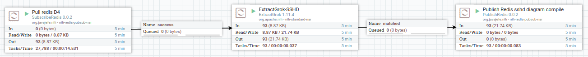
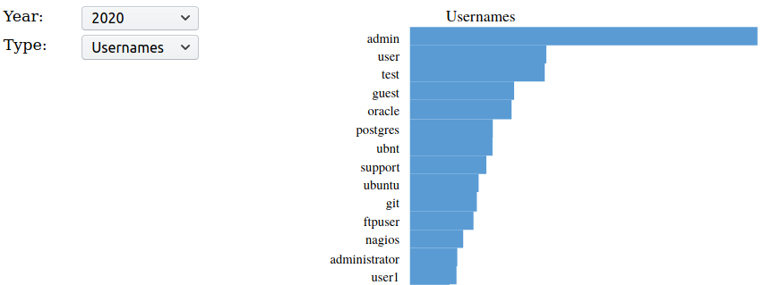
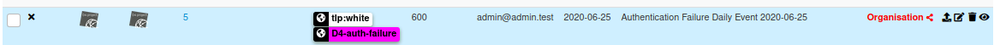
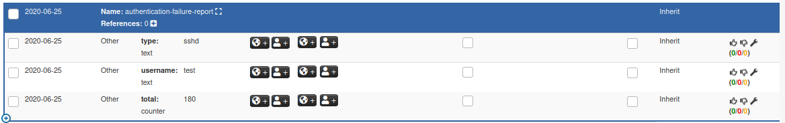
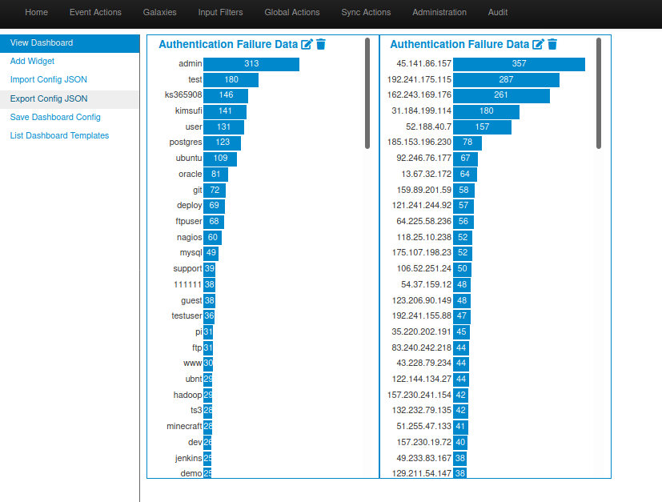

# analyzer-d4-log
This analyzer processes loglines ingested by d4 (as type 3).

# Architecture
analyzer-d4-log relies on redis to consume grokked loglines.

To grok the loglines, analyzer-d4-log relies on an external tool: both logstash https://www.elastic.co/logstash
and nifi https://nifi.apache.org/ have been tested for this purpose (using this nifi template https://github.com/D4-project/d4-nifi-templates).
These tools poll directly d4 server's redis for loglines and push the results into a specific redis queue that the analyzer consumes. 

analyzer-d4-log polls this queue periodically to produce counts and statistics of the data. At the moment, only sshd logs are supported but more will come in the future. 

# SSHD log analysis

## Output generation
Every once in a while, analyzer-d4-log compiles the result into a svg images and csv files. It will also produce a minimalist webpage to navigate the data with a datarangepicker.; 

## MISP export
I addition to this graphical view, the repository contains a MISP_export folder that allows for the publication of a MISP feed of daily events. It compiles the TOP 100 usernames and sources seen in ssh login failure by D4 sensors.

Since MISP 2.4.128, MISP can conveniently display this data through specialized widgets.

